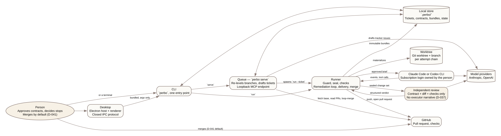
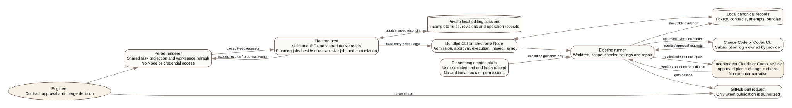

# System Architecture

Perbo is a local, open-source operating plane for coding agents. It runs Claude Code and Codex against a person's own repository, taking each piece of work from an approved contract to a reviewed pull request ([D-001](11-open-decisions.md)). Everything below runs on the person's own machine: there is no hosted service and no database. Hosted and shared features, such as team memory across people and machines, a shared queue and board, SSO and audit, are the commercial control plane and are not part of this architecture ([D-016](11-open-decisions.md), [docs/17](17-commercial-open-source-and-validation.md)).



## Desktop

The desktop is an Electron host and a sandboxed renderer that talk over a closed, validated protocol. The renderer has no Node or credential access, and every request and change event follows a schema the host defines. The host runs the bundled CLI as a child process, passing argv in and taking captured, redacted output back, and it reads the local store directly for records the CLI does not stream. Unfinished local edits, such as a draft contract, are saved and reconciled by the host as durable editing sessions, separate from the canonical tickets and contracts they eventually write ([ADR-0033](adr/0033-focrux-local-desktop-and-subscription-providers.md), [ADR-0034](adr/0034-desktop-editing-and-workspace-projection.md), [D-095](11-open-decisions.md)).



Decided, not built: the phone's surfaces, which follow pairing over the local network ([D-097](11-open-decisions.md)).

## CLI

One entry point, `perbo`, dispatches every command through one shell: help, version, unknown commands and error exit codes share a single implementation.

| Command | What it does |
|---|---|
| `doctor` | Diagnoses whether a repository can be materialized, naming the finding that would refuse a run |
| `baseline` | Captures a partner's direct-agent baseline before their first ticket ([D-038](11-open-decisions.md)) |
| `review` | Reviews a diff on its own, with no ticket behind it |
| `inspect` | Reads a ticket's attempts, bundles and reviews |
| `verdict` | Records the person's decision on a stop or a finding from the command line |
| `run` | Runs the loop over a contract: a bare `--config`, or an admitted ticket |
| `admit` | Drafts a contract from a tracker issue or a pasted file, or accepts a typed one |
| `approve` | The person's approval of a draft, which is the authority boundary ([D-072](11-open-decisions.md)) |
| `edit` | Opens a draft contract in `$VISUAL` or `$EDITOR`, or edits one field at a time |
| `list` | Lists admitted tickets |
| `sync` | Reads delivery state through local `git` and `gh` and writes it onto the ticket |
| `serve` | The queue over one store; see below |
| `mcp` | Prints the queue endpoint's connection block for a session started by hand |
| `agent` | Launches a person-driven Claude Code or Codex session with the endpoint injected |
| `stops` | Precision of stopping, read live from pull requests ([D-060](11-open-decisions.md)) |
| `escapes` | Of what merged, how much was undone or reworked afterwards |
| `principle` | Records a person's answer to a question no established practice settled ([D-065](11-open-decisions.md)) |

`tooling/package` bundles this one binary, every command included, into the design-partner tarball ([D-075](11-open-decisions.md)).

## The runner

One pipeline turns a ticket's contract into a pull request:

```text
contract → worktree → executor → sealed change set → deterministic checks
  → independent review → (remediation) → delivery → merge
```

**Worktree.** Each attempt chain gets one git worktree and branch, materialized from an exact base commit outside the repository, under `~/.perbo/worktrees/` and named by a hash of the repository path, so a package manager's workspace search never reaches into them. What is installed, and how it is verified, come from a declared environment contract that is diagnosed before anything is provisioned ([ADR-0025](adr/0025-worktree-environment-contract.md), [D-036](11-open-decisions.md)).

**Executor adapters.** There is one adapter for the Claude Code CLI and one for the Codex CLI. Each is launched with the repository's own settings, hooks, tool servers, skills, slash commands and instruction files closed off, and with an empty tool-server configuration, so nothing repository-supplied reaches the agent ([ADR-0030](adr/0030-neutralise-repository-supplied-agent-configuration.md)). The executor runs on the person's own Claude Code or Codex subscription login, with an API key optional. Up to three pinned, hashed engineering skills the person selected are appended to its brief ([D-093](11-open-decisions.md), [D-094](11-open-decisions.md)).

The executor may start subagents from the roles Perbo defines: on Claude an `Agent` or `Task` call naming anything else is refused before the subagent starts; on Codex only Perbo's roles are written into the isolated `CODEX_HOME`, and a subagent starting one of its own is refused once the runner sees it, since nothing about a spawn crosses the wire before it happens. Every subagent write passes the same scope guard, from that subagent's own directory or thread, every command is recorded against its role — on Codex, the role Codex reports for its thread — and review receives none of their activity ([D-106](11-open-decisions.md), [ADR-0038](adr/0038-subagents.md)).

**Write guard.** Every command and file write is judged by where it resolves before it runs: inside the worktree and inside the contract's approved paths, or not. A destructive, self-merging, publishing or tool-enabling act is refused outright. The runner never delegates a credentialed act to the agent: the commit, the push, the pull request and any merge are the runner's own. A write to a path the contract prohibits is refused before it happens, inside the approved paths as much as outside them, and the reviewer's `scope.prohibited_path` finding is the backstop behind it ([D-105](11-open-decisions.md)).

**The spec commit.** Where the ticket was drafted from a spec, the branch's first commit past the base is the spec the change is judged against, with the `CONTEXT.md` and ADR changes approval recorded beside it, made before the executor runs and refused where a recorded file has changed since approval. Every file it holds is left out of the change set, so review reads the diff after it while the pull request carries it ([D-103](11-open-decisions.md)).

**Seal.** The change set is `base_commit..HEAD`, read from `git diff --name-status` rather than a diff body, so nothing is lost to truncation. Materialized secrets are stripped by content hash before anything is committed, and a changed path outside the contract's approved globs is reported as a runner defect rather than left for the review to find.

**Checks.** The check set is pinned before the attempt starts and stays immutable while it runs, alongside the review policy, the corpus, any protected test a repository declares, and the store itself. None of them can be changed by the attempt they judge ([D-045](11-open-decisions.md)).

**Independent review.** At every risk level, the reviewer reads the contract, the diff and the check results, and never the executor's narrative or transcript. It returns a structured verdict over the plan's own criteria, never anything parsed from prose. A routing policy decides, per finding, whether it blocks, escalates, or goes back to the executor as remediable ([D-037](11-open-decisions.md), [D-065](11-open-decisions.md)).

Decided, not built: a person can attach other reviewers; Perbo reads what they leave on its pull requests and routes it like its own findings ([D-088](11-open-decisions.md)).

**Remediation loop.** A remediation round is a new attempt, with a new commit and a new change set, verified against the findings routed to it rather than reviewed again. Rounds are bounded, and a budget spent with a finding still open goes to a person instead of continuing ([D-061](11-open-decisions.md)). Before the executor runs, after every round's seal, and before the pull request opens, the base branch's current tip is merged into the attempt's branch, so every step judges the change against where a person would actually merge it. The runner enforces a stall detector on an attempt — 20 minutes with no tool activity ends it — and, where the executor is billed per token, a cost cap; a repository may also configure wall-clock, token, command and iteration ceilings ([D-096](11-open-decisions.md)).

**Delivery.** The runner pushes the attempt branch and opens or updates the pull request itself, through local `git` and `gh`, on its own held credential. The agent's environment never contains a token.

**Merge.** A person merges by default. A repository may opt into `merge: loop`. Then the loop, run directly or through the queue, merges its own pull request once a separate review run has approved the head, the checks are green, GitHub reports it mergeable, and nothing outside the loop has touched the branch ([D-041](11-open-decisions.md)).

Decided, not built: the merge switch trusts only the review run's own verdict comment (SCP-229), and accepts unsigned commits ([D-091](11-open-decisions.md), SCP-280).

## The packages

Each package's entry file names what the others may import from it, and the layout inside a package is in [docs/07](07-monorepo-and-deployment.md) ([ADR-0040](adr/0040-package-interface.md)).

| Package | Holds |
|---|---|
| `@perbo/contracts` | The typed shapes every other package shares: the ticket, the plan contract, the change set, check results, the review artifact, the run bundle, the materialization manifest, the limits table, and what counts as credential-shaped |
| `@perbo/model` | The model call: one port over one turn of the read-or-submit protocol, three transports onto it, and what a turn cost |
| `@perbo/review` | The reviewer: context assembly, the blocking and routing matrix, the structured verdict, closure verification, artifact redaction |
| `@perbo/workspace` | Git worktree provisioning, the environment diagnostic, materialization, process execution, and every git and `gh` process any package starts |
| `@perbo/runner` | The permission profile, the write guard, sealing, checks, the remediation loop, delivery and the merge step |
| `@perbo/planning` | Contract drafting from a tracker issue, a pasted file or a repository spec: a model proposes, a person approves. Reads and writes the spec folder and its page per node |
| `@perbo/evaluation` | The corpus, its harness and scorer, and the regression suite that gates a change to the reviewer ([D-010](11-open-decisions.md), [regression suite](evaluation/regression-suite.md)) |

A contract, drafted or typed, carries an outcome, its acceptance criteria and a proposed scope ([D-072](11-open-decisions.md)). Once approved it is immutable. Large work stays one ticket: the plan may group its criteria into nodes, each naming the paths expected to satisfy them, and `perbo inspect` shows the graph with a size derived from it ([D-100](11-open-decisions.md), [D-104](11-open-decisions.md)). The order between nodes and the spec's No-Gos are approach, kept beside the ticket and never given to the reviewer. There is no epic kind.

A graph is reviewed once per node — that node's criteria, the part of the diff inside its paths, and that node's own check results — and once over the whole change, with the gate reading the combination ([D-107](11-open-decisions.md)). Planning mode is built: Create, its picker, the Spec pane, which holds the spec, the Explorer pane, the Graph pane, which curates the execution graph and confirms it to the contract, where it is approved once, the Impact pane, which lists what a draft is likely to touch outside its scope, checked once when the planning first has a plan and by its button after that, and planning alongside a run. Drafting, admission, contract edits and impact checks run any number at a time; runs, decisions, findings, delivery refreshes, product decisions and readiness checks take one ([D-101](11-open-decisions.md)).

The interview is built on both transports: the person's own Claude Code or Codex session, writing only the spec folder, `CONTEXT.md` and ADRs ([D-102](11-open-decisions.md)).

## The queue and the endpoint

`perbo serve` is one process that outlives a run. On each tick it:
- fetches the base ref;
- reads every open pull request through `sync` and, under `merge: loop`, asks each open pull request in queue order to merge until one does, reconciling any ticket a killed run left mid-state the same way;
- decides which tickets wait by set arithmetic over approved records, with no model involved ([ADR-0011](adr/0011-control-loop-not-agent-organisation.md)): `depends_on`, and the paths a ticket ahead still holds, by its globs until it has sealed and by what it actually changed afterwards;
- starts runs as child `perbo run` processes, up to `concurrent_local_attempts` ([D-049](11-open-decisions.md));
- drafts one labelled tracker issue into `plan_review`, the same model call `admit --from` makes by hand ([D-108](11-open-decisions.md)).

The queue hosts a loopback HTTP MCP endpoint with one capability token per role. The person's token reaches every read, plus `admit`, `edit`, `sync`, and pausing or resuming the queue; the drafter's token reaches only reads. `approve`, `--publish` and merging are not tools the endpoint can offer, by construction ([D-109](11-open-decisions.md)).

`perbo agent` launches a separate, person-driven Claude Code or Codex session with the endpoint injected through a file or an environment variable, never a command line. It is not a ticket's executor, which never receives a tool server at all; nothing about the session is neutralised, and it holds no authority in the loop. `perbo mcp` prints the same connection block for a session started by hand. `perbo interview` starts a third kind of session, also the person's own and also not the loop's: it runs through the Claude Agent SDK or `codex app-server` with the interview's own tools in-process, and every write it makes is decided by the runner's write guard, with that spec's own folder, `CONTEXT.md` and the ADR folder as the only places it may write.

## The local store

`.perbo/` at the repository root holds every record local execution produces:

| Path | Holds |
|---|---|
| `config.json` | Checks, protected paths, the standing prohibited paths, limits, `merge`, the tracker, `specs` |
| `principles.md` | A person's recorded answers |
| `tickets/` | One ticket, one contract and one draft per admitted key |
| `bundles/` | Immutable run bundles |
| `reviews/` | Reviews of changes no ticket ran |
| `state/` | Locks, attempts, the endpoint record, stop and escape history |
| `quarantine/` | Agent configuration withheld during an attempt |

Worktrees live outside the repository, under `~/.perbo/worktrees/`, so a repository's own package manager never treats one as part of its workspace.

## What leaves the machine

The executor reads its worktree, materialized secrets included, and its model provider receives what it reads; the reviewer's file reader refuses secret-shaped paths. Materialized secrets are stripped by content hash from everything Perbo writes ([D-012](11-open-decisions.md)). Both run on the person's own Claude Code or Codex subscription login, with an API key optional ([D-093](11-open-decisions.md)). GitHub stays authoritative for refs, commits, pull requests and checks. The runner and the queue reach it only through local `git` and `gh`, on a credential the agent never sees, and nothing here is a webhook or an installed app ([D-003](11-open-decisions.md)).


Repository and external content are read as data and never occupy an instruction position, from the executor's brief to the reviewer's context ([D-035](11-open-decisions.md), [ADR-0023](adr/0023-untrusted-context-boundary.md)).
